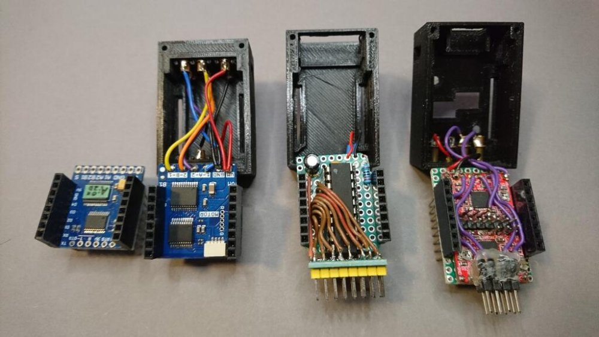

# I2C ServoController for ATtiny2313 and ATtiny26

This is a firmware for ATtiny2313 and ATtiny26 target (slave) devices that enables you to control up to 10 servo motors by a controller (master) device via I2C.

Original code by [Stefan Frings](http://stefanfrings.de/). Find his [original documentation (in German) here](https://github.com/ftjuh/ServoController/tree/v1.0.0/doc) and an archived version of his original page (now offline) [at archive.org](https://web.archive.org/web/20211019191937/http://stefanfrings.de/servocontroller/index.html).

This repository includes the original code in [release 1](https://github.com/ftjuh/ServoController/releases/tag/v1.0.0), with bug fixes and additional documentation  in [subsequent releases](https://github.com/ftjuh/ServoController/releases) maintained by me ([ftjuh](https://github.com/ftjuh)).

### Why use this instead of PCA9685 and the like?

If you need servo control over I2C, you can use a number of dedicated chips and modules, e.g. the  [PCA9685](https://www.nxp.com/products/power-management/lighting-driver-and-controller-ics/led-controllers/16-channel-12-bit-pwm-fm-plus-ic-bus-led-controller:PCA9685), which in most cases will do just as well or even better. So you'll probably want to use this firmware only in special cases, e.g.

- if the usual modules are too big for your needs,
- if you want to customize the firmware,
- if you need a special I2C address for some reason, or
- if you want an example of a "raw" I2C target (slave) implementation which doesn't use a library.

In fact, Stefan's solution of using the three ATtiny timers for 10 servos is quite clever and instructive, and with only 1.6 Kb it's an impressive example of what you can get out of an ATtiny's very limited resources. On the other hands, it is also an example of the [dangers](https://github.com/ftjuh/ServoController/issues/1) of ignoring (or having to ignore) the merits of software reusability.

If you need a more generic solution for servo control over I2C, maybe in combination with other functionality, have a look at my [I2Cwrapper project](https://github.com/ftjuh/I2Cwrapper) and its [ServoI2C module](https://github.com/ftjuh/I2Cwrapper#servoi2c).

### Example and demonstration

I used Stefan's code for my [WeFish fischertechnik controller](https://forum.ftcommunity.de/viewtopic.php?f=33&t=6359) system, which is build around the Wemos D1 mini and compatibles. For the servo module , the ubiquitous PCA9685 modules would have been too big, while a bare ATtiny2313 with two capacitors was a natural fit (the servo module is in the middle):



Watch it in action in this video:

[](https://www.youtube.com/watch?v=pucE0ek1lFc)


This is the relevant Arduino code snippets from the above example, which used only one servo:

```cpp
const byte servoUpPos = 108;
const byte servoDownPos = 125;

void setServo(byte pos) { // Stefan Fring's ATtiny2313 I2C servo driver
  Wire.beginTransmission(0x0F);
  Wire.write(pos); // only write servo 0 and be done
  Wire.endTransmission();
}

void plotAt(int mmTarget) { // make a dot at mmTarget mm
  runToMM(mmTarget);
  setServo(servoDownPos);
  delay(100);
  setServo(servoUpPos);
}
```

# Author

Original code by [Stefan Frings](http://stefanfrings.de/).

Bug fixes and additional documentation by [ftjuh](https://github.com/ftjuh).

# License

GNU GENERAL PUBLIC LICENSE (GPL)

